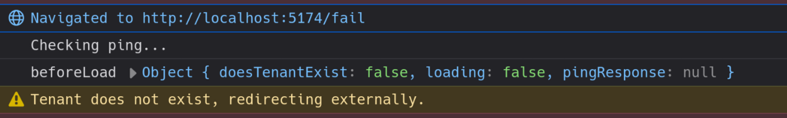
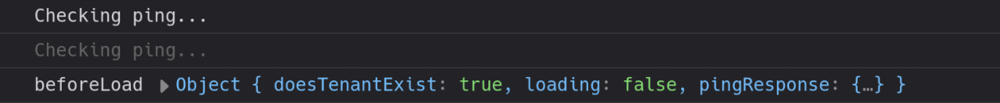

# Minimal reproduction for issue with TanStack Query 5.85.2

## Steps

- install dependencies and run vite dev server

  ```sh
  npm install
  npm run dev
  ```

- visit the site (<http://localhost:5174>) with dev tools open
- notice that you are redirected to `/fail` and the `pingResponse` is `null`

  

- stop the vite server
- downgrade to `@tanstack/react-query@5.85.1`

  ```sh
  npm install @tanstack/react-query@5.85.1
  ```

- run vite again and visit the site and notice that you don't get redirected and the response is now available

  ```sh
  npm run dev
  ```

  
